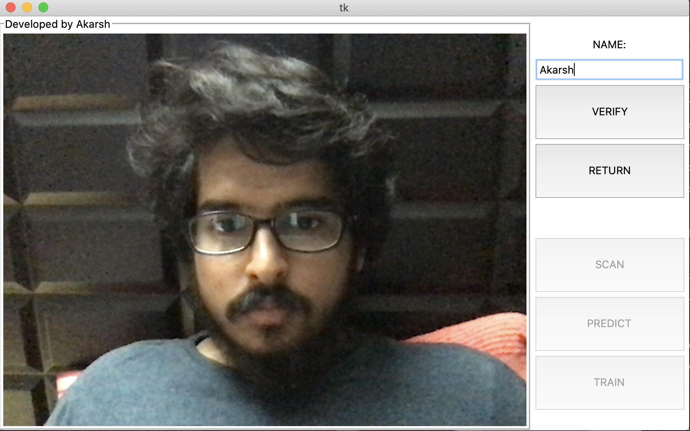
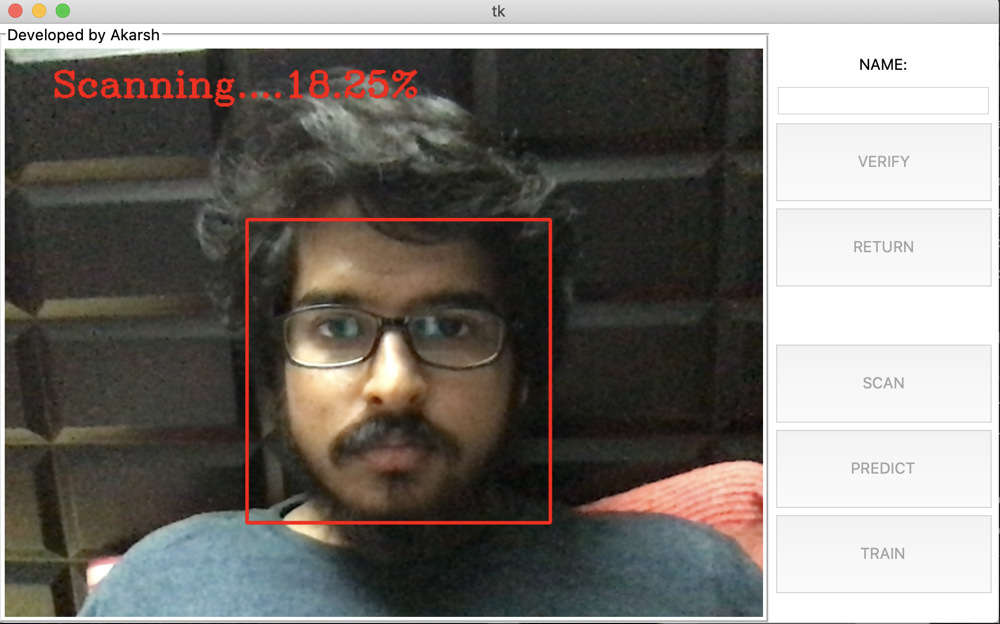
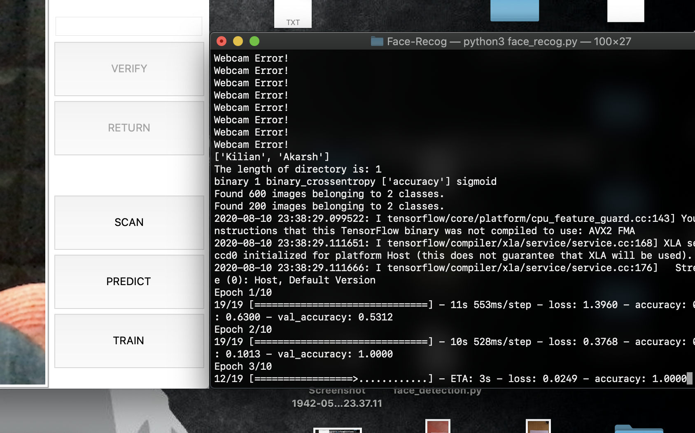
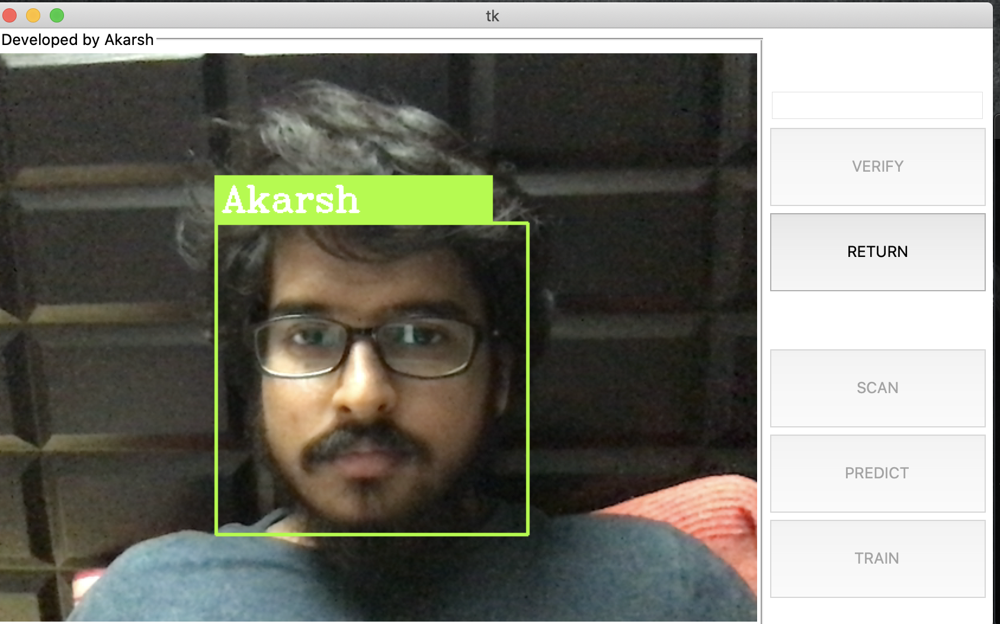

# Face-Recognition

## Introduction
A Machine Learning script to detect a users face using haarcascade like feature and predict on users face using CNN (Convolutional Neural Networks).

## Required modules: 
  1) keras
  2) numpy
  3) cv2
  
 To run: face_recog.py follow:
 
 1) Open terminal and redirect to Face_Recog directory and type in :"python3 face_recog.py"
 2) Click on SCAN button and enter your name:
 
 
 3) Click on VERIFY button to start scanning your face
 
 
 4) After scanning click on TRAIN button to train the model:
 
 
 5) After training model, click on PREDICT button to predict on the face:
 
 

 NOTE:- Atleast scan two faces for results.
